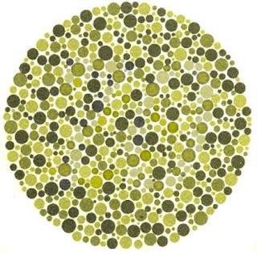
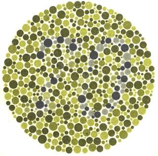

# Daltonize

Daltonize simulates the three types of dichromatic color blindness and
images and matplotlib figures. Generalizing and omitting a lot of
details these types are:

* Deuteranopia: green weakness
* Protanopia: red weakness
* Tritanopia: blue weakness (extremely rare)

Daltonize can also adjust the color palette of an input image such
that a color blind person can perceive the full information
content. It can be used as a command line tool to convert pixel images
but also as a Python module. If used as the latter, it provides an API
to simulate and correct for color blindness in matplotlib figures.

This allows to create color blind friendly vector graphics suitable
for publication.

## Installation

```
git clone git@github.com:joergdietrich/daltonize.git
```

and copy `daltonize.py` to a location in your `$PATH` and/or
`$PYTHONPATH`. Daltonize depends

* Pillow: https://python-pillow.github.io/
* numpy: http://www.numpy.org/

```
pip install numpy Pillow
```

and

* matplotlib: http://matplotlib.org/

```
pip install matplotlib
```

if it is used to work on matplotlib figure objects.

## Usage

As a command line tool:

```
$ daltonize.py -h
usage: daltonize.py [-h] [-s | -d] [-t {d,p,t}] input_image output_image

positional arguments:
  input_image
  output_image

optional arguments:
  -h, --help            show this help message and exit
  -s, --simulate        create simulated image
  -d, --daltonize       adjust image color palette for color blindness
  -t {d,p,t}, --type {d,p,t}
                        type of color blindness (deuteranopia, protanopia,
                        tritanopia), default is deuteranopia (most common)
```

As a Python module:

```
In [1]: import daltonize

[ Create a figure ]

In [10]: sim_fig = daltonize.simulate_mpl(fig, copy=True)

In [11]: daltonized_fig = daltonize.daltonize_mpl(fig, copy=True)
```

## Credits

Based on the work and original matlab code by Onur Fidaner, Poliang
Lin, Nevran Ozguven. This can be found in 'doc/'.

Based on original Python code by Oliver Siemoneit.

Further information on color blindness and daltonization is available
at many web resources, including http://www.daltonize.org/

Color blind friendly color maps can be found at
http://colorbrewer2.org/ All of these are included in the python
matplotlib and seaborn plotting libraries.

## Example Images for Color Blindness

The directory 'example_images/' contains three example Ishihara plates
to test for red-green deficiency. This table describes what people
with normal, red/green deficient color vision, and total color
blindness see on these plates:

| Plate     | Normal      | r/g deficiency  | total color blindness |
|:---------:|:-----------:|:---------------:|:---------------------:|
| 3	    | 29          | 70              |       x	            |
| 7         | 74          | 21		    |       x               |
| 8	    |  6          |  x		    |       x               |

You can verify the r/g deficiency column by running daltonize.py with
the `-s/--simulate` option and `-t/--type d` or `p` on these images.

### Normal


### Deuteranopia

```
python daltonize.py -s -t=d example_images/Ishihara_Plate_3.jpg example_images/Ishihara_Plate_3-Deuteranopia.jpg
```



### Protanopia

```
python daltonize.py -s -t=p example_images/Ishihara_Plate_3.jpg example_images/Ishihara_Plate_3-Protanopia.jpg
```



## License

This code is released und the GNU GPL version 2. See COPYING for details.
